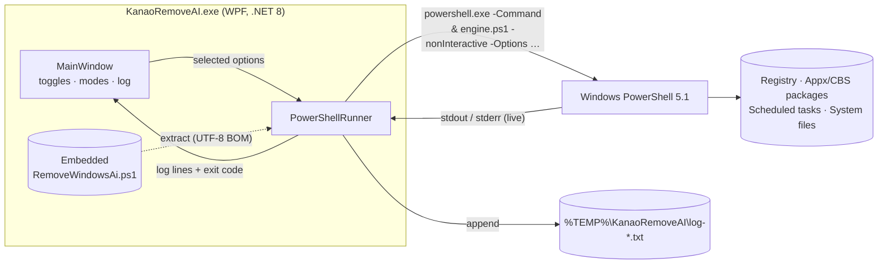
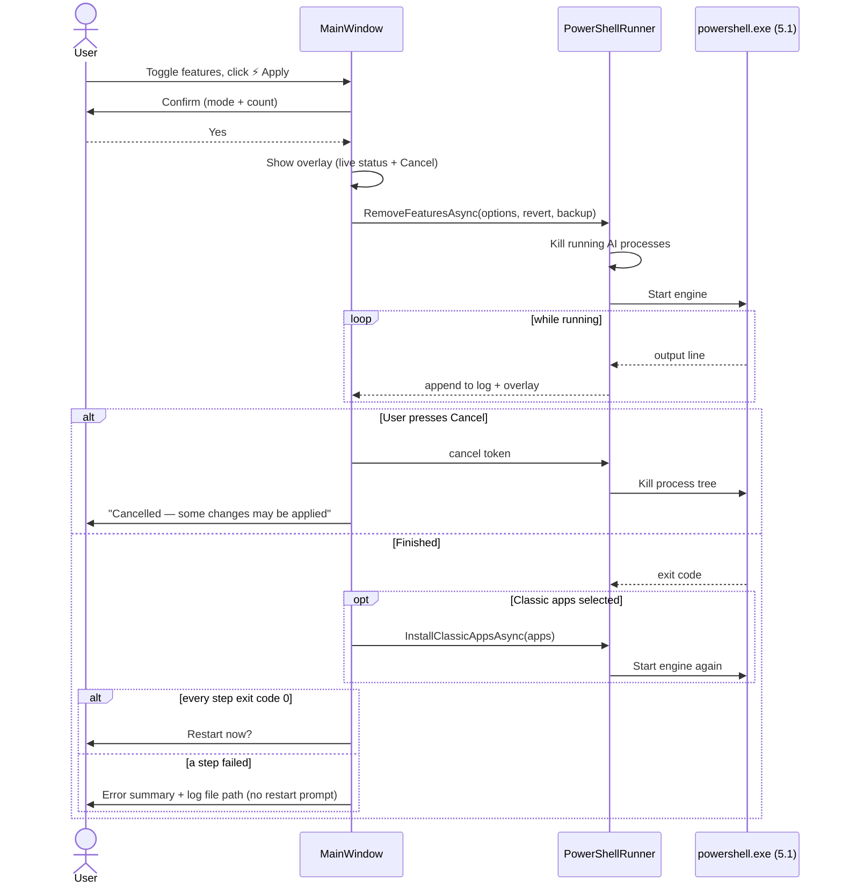
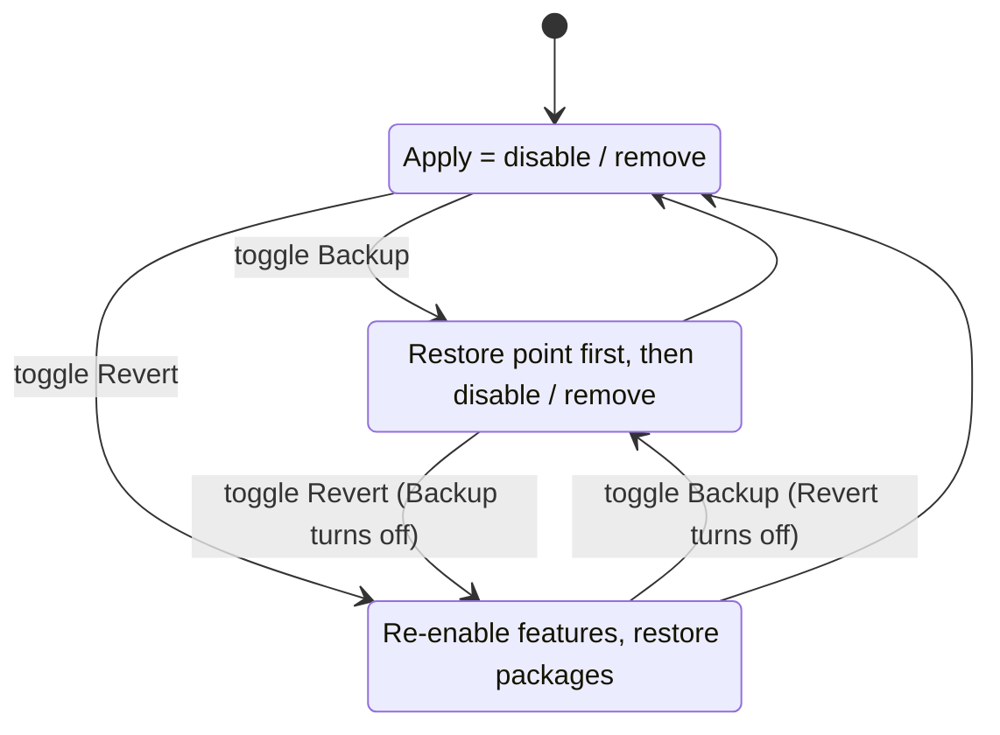

# ⚡ KANAO Remove AI

[](https://github.com/adisorn6302565/KANAO-Remove-AI/actions/workflows/build.yml)


**GUI สำหรับปิด / ลบฟีเจอร์ AI ใน Windows 10/11** (Copilot, Recall, AI ใน Paint/Notepad/Snipping Tool ฯลฯ) ด้วยการคลิกเดียว

A WPF front-end for the [RemoveWindowsAI](https://github.com/zoicware/RemoveWindowsAI) engine by **@zoicware** — toggle what you want, press **Apply**, restart.

> ⚠️ This tool changes the registry, removes system packages and deletes system files. Turn on **Backup Mode** (creates a System Restore point) and try it in a VM first if unsure.

---

## Contents

- [Download](#-download)
- [How it works](#-how-it-works)
- [Features](#-features)
- [Usage](#-usage)
- [Build from source](#-build-from-source)
- [What's new in v1.1](#-whats-new-in-v11)
- [Troubleshooting](#-troubleshooting)
- [Credits & license](#-credits--license)

---

## 📥 Download

Get the latest build from **[Releases](../../releases)**:

| File | Size | Needs |
|---|---|---|
| `KanaoRemoveAI.exe` | ~70 MB | nothing — self-contained |
| `KanaoRemoveAI-small.exe` | ~0.5 MB | [.NET 8 Desktop Runtime](https://dotnet.microsoft.com/download/dotnet/8.0) |

Both require **administrator** rights (UAC prompt on launch).

---

## 🧩 How it works

The GUI does not re-implement anything: it passes your selections to the bundled engine script, running it in **Windows PowerShell 5.1** (the engine does not support PowerShell 7).



### Apply sequence



### Modes



---

## 🔥 Features

| Group | Option | Engine flag | What it does |
|---|---|---|---|
| **Core** | Disable AI Registry Keys | `DisableRegKeys` | Copilot, Recall, Input Insights, AI Actions, Voice Access, AI voice effects, Gaming AI, Office AI, AI in Settings search |
| | Disable Copilot Policies | `DisableCopilotPolicies` | Edits `IntegratedServicesRegionPolicySet.json` |
| | Hide AI Components | `HideAIComponents` | Hides the *AI Components* page in Settings |
| **Packages** | Remove AI Appx Packages | `RemoveAppxPackages` | Removes AI Appx packages, including non-removable/inbox ones |
| | Remove AI CBS Packages | `RemoveCBSPackages` | Removes hidden AI packages from the Component-Based Servicing store |
| | Prevent AI Reinstall | `PreventAIPackageReinstall` | Installs a blocker package so Windows Update does not reinstall them (downloaded from the engine repo) |
| **Deep clean** | Remove AI Files & Folders | `RemoveAIFiles` | Installers, ML DLLs, Copilot installers, leftovers |
| | Remove Recall Feature | `RemoveRecallFeature` | Optional feature → *DisabledWithPayloadRemoved* |
| | Remove Recall Tasks | `RemoveRecallTasks` | Deletes Recall scheduled tasks |
| **Apps** | Disable Notepad AI Rewrite | `DisableRewrite` | Turns off Rewrite in Notepad |

**Classic apps:** Photo Viewer (`photoviewer`), Paint (`mspaint`), Snipping Tool (`snippingtool`), Notepad (`notepad`), Photos Legacy (`photoslegacy`).

---

## 🚀 Usage

1. Run `KanaoRemoveAI.exe` and accept UAC.
2. Turn on **Backup Mode** (recommended the first time).
3. Toggle the features / classic apps you want — click a card or its switch; `?` shows the full description.
4. Click **⚡ Apply** and confirm. Progress is shown live; **✖ Cancel** stops the engine.
5. Restart when prompted.

To undo: turn on **Revert Mode**, select the same options, **Apply**. Or use the restore point from Backup Mode.

Every run is logged to `%TEMP%\KanaoRemoveAI\log-<date>-<time>.txt` — the **📄 Open Log** button opens it.

---

## 🛠️ Build from source

Requires the .NET 8 SDK on Windows.

```powershell
git clone https://github.com/adisorn6302565/KANAO-Remove-AI.git
cd KANAO-Remove-AI
dotnet publish RemoveWindowsAI.csproj -c Release -o publish
# -> publish\KanaoRemoveAI.exe
```

**Updating the engine:** replace `Resources/RemoveWindowsAi.ps1` with a newer copy from [zoicware/RemoveWindowsAI](https://github.com/zoicware/RemoveWindowsAI) and rebuild — or, without rebuilding, drop `RemoveWindowsAi.ps1` next to the EXE; a file there takes priority over the embedded one.

**Releasing:** push a tag such as `v1.1.0`; GitHub Actions builds both EXEs and attaches them to a Release.

```text
KANAO-Remove-AI/
├── App.xaml(.cs)
├── MainWindow.xaml(.cs)          # UI, feature list, apply / cancel / report
├── Models/FeatureItem.cs
├── Services/
│   ├── PowerShellRunner.cs       # runs the engine in powershell.exe 5.1
│   └── AdminHelper.cs
├── Themes/DarkTheme.xaml
├── Resources/RemoveWindowsAi.ps1 # engine (zoicware, MIT)
├── app.manifest                  # requireAdministrator
└── .github/workflows/build.yml   # CI build + Release on tag
```

---

## 🆕 What's new in v1.1

| v1.0 | v1.1 |
|---|---|
| The engine ran inside the embedded **PowerShell 7** SDK. The engine exits immediately on PS 7, so **no option was actually applied**, but the UI still said "Operation completed successfully" | Runs in **Windows PowerShell 5.1** as a separate process, as the engine requires |
| Always reported success and offered a restart | Uses the real exit code; on failure shows a summary and the log path, with no restart prompt |
| Overlay hid the log; the run could not be stopped | Overlay shows the live output line and a **Cancel** button that kills the engine |
| The window could be closed mid-run | Closing is blocked while a run is in progress |
| No log file | Full log in `%TEMP%\KanaoRemoveAI`, **Open Log** button |
| The overlay briefly hid between the feature run and the classic apps run | One continuous overlay for the whole run |
| 87 MB EXE committed to git (bundled the PowerShell SDK) | PowerShell SDK removed: 72 MB self-contained or 0.5 MB small build, published through GitHub Releases |
| No credit for the engine | Credits and MIT notice for zoicware/RemoveWindowsAI |

---

## ❓ Troubleshooting

| Problem | Fix |
|---|---|
| "⚠ Not Admin" in the header | Right-click → *Run as administrator* |
| Finished with errors | Click **Open Log** and look at lines starting with `ERROR:` |
| *Prevent AI Reinstall* fails | It downloads a package from GitHub, so check your internet/firewall |
| Features came back after a Windows update | Run again with *Prevent AI Reinstall* enabled |
| Antivirus flags the EXE | Expected for tools that modify system packages; build from source to verify |

---

## 📄 Credits & license

- **Engine:** [RemoveWindowsAI](https://github.com/zoicware/RemoveWindowsAI) © zoicware, MIT License. See [THIRD_PARTY_NOTICES.md](THIRD_PARTY_NOTICES.md).
- **GUI:** KANAO ⚡, provided as-is for personal and educational use.
